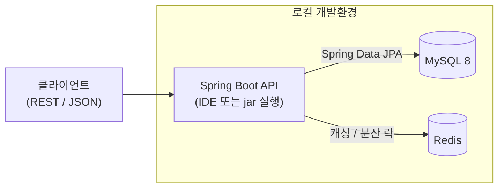

# 재고관리 API (Inventory Management API)

상품·재고·입출고 이력을 관리하는 Spring Boot 기반 REST API 서버입니다.
실무에서 자주 쓰이는 스택(Spring Security/JWT, Redis 캐싱·분산 락, MySQL, Docker, AWS)을
직접 적용하는 것을 목표로 한 포트폴리오 프로젝트입니다.

## 기술 스택

| 구분 | 기술 |
| --- | --- |
| Language | Java 21 (LTS) |
| Framework | Spring Boot 3.4.x |
| Persistence | Spring Data JPA, Flyway (DB 마이그레이션) |
| Database | MySQL 8 |
| Cache / Lock | Redis |
| Security | Spring Security + JWT |
| API Docs | SpringDoc OpenAPI (Swagger UI) |
| Build | Gradle (Wrapper 8.12) |
| Infra | Docker Compose (로컬), AWS EC2/RDS/ElastiCache (운영) |

## 주요 기능

| Method | Endpoint | 설명 |
| --- | --- | --- |
| GET | `/api/products` | 상품 목록 조회 (Redis 캐싱) |
| GET | `/api/products/{id}` | 상품 상세 조회 (Redis 캐싱) |
| POST | `/api/products` | 상품 등록 |
| PUT | `/api/products/{id}` | 상품 수정 |
| DELETE | `/api/products/{id}` | 상품 삭제 |
| GET | `/api/inventory/{productId}` | 재고 조회 |
| POST | `/api/inventory/in` | 입고 처리 (Redis 분산 락) |
| POST | `/api/inventory/out` | 출고 처리 (Redis 분산 락) |
| POST | `/api/auth/signup` | 회원가입 |
| POST | `/api/auth/login` | 로그인 (JWT 발급) |
| POST | `/api/auth/logout` | 로그아웃 (토큰 블랙리스트) |

> 현재 단계는 **프로젝트 초기 세팅**(빌드/인프라/엔티티/스키마)까지 완료되었습니다.
> 위 API의 Controller/Service/Security 로직은 다음 단계에서 구현합니다.

## 아키텍처 구성도



- **로컬**: MySQL·Redis는 Docker Compose로 띄우고, 애플리케이션은 IDE에서 직접 실행합니다.
- **운영**: EC2에 jar를 직접 배포하고, DB는 RDS(MySQL)·캐시는 ElastiCache(Redis)를 사용합니다.

## 실행 방법

### 1. 인프라 기동 (MySQL + Redis)

```bash
docker compose up -d
```

### 2. 애플리케이션 실행

IDE에서 `InventoryApplication`을 실행하거나, Gradle Wrapper로 실행합니다.
별도 지정이 없으면 `local` 프로파일로 동작합니다.

```bash
./gradlew bootRun
```

### 3. 종료

```bash
docker compose down        # 컨테이너 종료 (데이터 유지)
docker compose down -v     # 컨테이너 + 데이터 볼륨 삭제
```

## API 문서 (Swagger)

앱 실행 후 아래 주소에서 확인할 수 있습니다.

- Swagger UI: <http://localhost:8080/swagger-ui.html>
- OpenAPI JSON: <http://localhost:8080/v3/api-docs>

> Spring Security가 적용되어 있어, Swagger 등 공개 경로 허용 설정(SecurityConfig)은
> 인증 단계 구현 시 함께 추가됩니다.

## 프로젝트 배경

일본 근무 당시 제품 재고 관리 업무를 직접 담당하면서, 수기·엑셀 중심의 관리에서
발생하던 비효율과 휴먼 에러를 가까이에서 겪었습니다. 그 경험을 계기로 "실제 비즈니스
문제를 기술로 풀어보자"는 생각에서 재고관리를 주제로 선택했습니다.

또한 이 프로젝트는 **개발 공백기 이후** 다시 개발에 복귀하면서, 그동안 표준으로 자리잡은
Redis·AWS·Docker 등 현대적인 스택을 직접 적용해보는 것을 목표로 합니다. 익숙함에 안주하지
않고 실무에서 통용되는 방식을 하나씩 적용하며 감각을 되찾아가는 과정임을 솔직하게 밝힙니다.