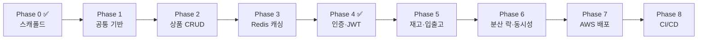

# productAPI 로드맵

> 재고관리 REST API 포트폴리오 프로젝트의 단계별 진행 지도.
> Created: 2026-05-29 · Status: Living document (단계 진행에 따라 갱신)

## 배경

Spring Boot 기반 재고관리 API를 스캐폴드(Phase 0)부터 AWS 배포·CI/CD까지 완성하는 것을 목표로 한다.
개발 공백기 이후 현대 스택(Redis·AWS·Docker·Spring Security/JWT)을 직접 적용하며 감각을 회복하는 것이
프로젝트의 한 축이므로, 본 로드맵은 **직접 점진 구현**에 맞춰 단계를 작게 쪼개고 **난이도가 점증**하도록
정렬했다. 각 단계는 단독으로 동작·검증 가능하며, 끝나면 "돌아가는 무언가"가 남는다.

## 설계 원칙

- **작고 독립적인 단계** — 한 단계가 끝나면 실행·검증 가능한 결과물이 남는다.
- **난이도 점증** — 익숙한 기본(MVC+JPA CRUD) → 선언적 Redis 캐싱 → 보안(필터체인) → 트랜잭션 도메인 → 분산 락 동시성(최고 난도).
- **단계별 Definition of Done(DoD)** — ① `./gradlew build` ② 단위 + Testcontainers 통합테스트 ③ `docker compose up` 후 앱 기동 스모크 ④ Swagger 수동 확인.
- **테스트 내장** — 테스트는 별도 단계가 아니라 각 단계 DoD의 일부.

## 전체 흐름

| Phase | 목표 | 핵심 기술/개념 | 규모 | 상태 |
|---|---|---|---|---|
| 0 | 스캐폴드 | Gradle, Docker, JPA, Flyway | — | ✅ 완료 |
| 1 | 공통 기반 | Repository, 예외처리, 공통 응답, Swagger | S | 예정 |
| 2 | 상품 CRUD | Spring MVC, DTO, Bean Validation, Testcontainers | M | 예정 |
| 3 | Redis 캐싱 | `@Cacheable`/`@CacheEvict`, RedisCacheManager | S | 예정 |
| 4 | 인증·JWT | Spring Security 필터체인, JWT, Redis 블랙리스트 | L | ✅ 구현 완료 |
| 5 | 재고·입출고 | 트랜잭션, 도메인 로직, StockLog | M | 예정 |
| 6 | 분산 락·동시성 | Redis 분산 락, 동시성 통합테스트 | L | 예정 |
| 7 | AWS 배포 | EC2(jar) / RDS / ElastiCache, prod profile | M | 예정 |
| 8 | CI/CD | GitHub Actions (build/test, 선택적 배포) | S | 예정 |

> 규모: S(작음) / M(중간) / L(큼). 순서는 권장안이며 단계별로 조정 가능.

---

## 단계 상세

### Phase 0 — 스캐폴드 ✅ (완료)
- 빌드/인프라(`build.gradle`, Gradle wrapper 8.12, `docker-compose.yml`), profile 분리(local/prod), 엔티티 4개, Flyway `V1__init_schema.sql`.
- `docker compose up` → 앱 기동 → Flyway 마이그레이션 + Hibernate `validate` 통과까지 런타임 스모크 검증 완료.
- 현재 보안 미설정 상태라 모든 엔드포인트 401.

### Phase 1 — 공통 기반 (Common Foundation)
- **목표**: 이후 모든 단계가 올라설 공통 토대 + Spring 기본 패턴 재정립.
- **산출물**: `repository/` 4개(`JpaRepository`), 공통 응답 `dto/response/ApiResponse`, `exception/GlobalExceptionHandler` + `ErrorCode`/커스텀 예외, `config/OpenApiConfig`(Swagger), **임시** `security/SecurityConfig`(전부 permitAll — Phase 4에서 정식 잠금, "임시"임을 주석·문서에 명시).
- **DoD**: 빌드 통과 + 앱 기동 후 `/swagger-ui.html` **200** 확인.
- **상세 설계**: [docs/design/phase1-common-foundation.md](design/phase1-common-foundation.md)

### Phase 2 — 상품 CRUD
- **목표**: 상품 5개 API(목록/상세/등록/수정/삭제) 완성 — MVC+JPA 풀스택 1회전.
- **산출물**: `ProductController`, `ProductService`, request/response DTO, Bean Validation, 단위/통합 테스트. **Testcontainers(MySQL) 통합테스트 환경 최초 도입**.
- **DoD**: Swagger에서 CRUD 수동 동작 + 통합테스트 그린.

### Phase 3 — Redis 캐싱
- **목표**: 상품 조회(목록/상세) 캐싱 — 첫 Redis 연동(선언적, 난도 낮음).
- **산출물**: `config/RedisConfig`(직렬화/`RedisCacheManager`), 조회 `@Cacheable` / 변경 `@CacheEvict`, 캐시 통합테스트(Testcontainers Redis).
- **DoD**: 동일 조회 2회 시 2번째 DB 미조회(로그/테스트로 확인).

### Phase 4 — 인증·보안 (JWT) ✅
- **목표**: 회원가입/로그인(JWT 발급)/로그아웃(토큰 블랙리스트) + 전체 엔드포인트 인가.
- **산출물**: `MemberService`(BCrypt), `AuthController`, `security/JwtTokenProvider`·`JwtAuthenticationFilter`, `SecurityConfig` 정식 잠금(공개: auth·swagger / 그 외 인증), Redis 로그아웃 블랙리스트, 인증 통합테스트.
- **DoD**: 토큰 없이 보호 API 401, 로그인 토큰으로 200, 로그아웃 후 해당 토큰 401.

### Phase 5 — 재고·입출고
- **목표**: 재고 조회 + 입고/출고 + 입출고 이력(StockLog) 기록 (단일 스레드 정합성 먼저).
- **산출물**: `InventoryController`/`InventoryService`(`@Transactional`), 재고 증감 + StockLog 기록, 출고 시 재고 부족 검증, 단위/통합 테스트.
- **DoD**: 입고/출고 후 수량·이력 정확, 재고 부족 시 명확한 에러 응답.

### Phase 6 — Redis 분산 락 + 동시성
- **목표**: 동시 입출고 시 재고 정합성 보장 (기술적 하이라이트).
- **산출물**: 입출고 임계구역에 Redis 분산 락 적용, **동시성 통합테스트**(다중 스레드 동시 출고 → 최종 수량 정확, 음수 없음).
- **결정 보류**: 락 구현체 **Redisson(RLock, 권장)** vs Lettuce 수동 `SETNX` — Phase 6 design doc에서 확정.
- **DoD**: 락 없을 때 실패 → 있을 때 통과 대비를 보이는 동시성 테스트 그린.

### Phase 7 — AWS 배포
- **목표**: EC2에 jar 직접 배포, RDS(MySQL)·ElastiCache(Redis) 연결, prod profile 실증.
- **산출물**: 배포 절차 문서, prod 환경변수/시크릿 주입 검증, (선택) systemd 서비스·Nginx 리버스 프록시, 운영 Flyway 마이그레이션 확인.
- **DoD**: 퍼블릭 환경에서 Swagger·핵심 API 동작.

### Phase 8 — CI/CD
- **목표**: PR 시 자동 빌드·테스트, (선택) 자동 배포.
- **산출물**: GitHub Actions 워크플로우(`./gradlew build` + 테스트, Testcontainers 실행), (선택) main 머지 시 EC2 배포 스텝.
- **DoD**: PR에서 CI 그린.

---

## 단계 순서 결정 & 근거

- **Decision**: `공통기반 → 상품CRUD → 캐싱 → 인증 → 재고 → 분산락 → 배포 → CI/CD` (난이도 점증·도메인 우선, 보안은 중반).
- **Alternatives**: ① 보안 최우선(공통→인증→상품→재고) ② 보안 최후(모든 도메인 후 인증).
- **Rationale**: 직접 점진 구현하며 감각을 회복하는 단계이므로, Spring Security 필터체인·분산 락 같은 고난도 영역을 기본기(MVC+JPA CRUD) 재정립 이후에 배치. 선언적 캐싱을 보안보다 앞에 둬 Redis를 부드럽게 도입. 분산 락 동시성을 마지막 도메인 작업으로 두어 "그랜드 피날레"로 구성.
- **Impact**: Phase 1~3 동안 엔드포인트가 임시 개방되나, **임시 `SecurityConfig` 단일 파일**에 격리하고 Phase 4에서 정식 잠금 → 재작업 최소.

## 고정 전제 (변경 시 별도 논의)

- Java 21 (LTS) · Spring Boot 3.4.2 · Gradle wrapper 8.12 · Flyway(스키마 단일 소스) · JPA `ddl-auto=validate`.
