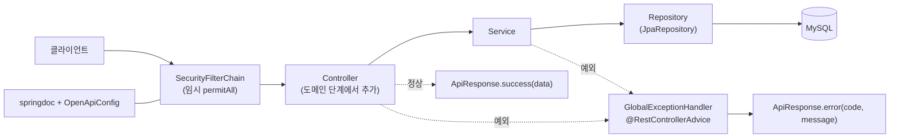
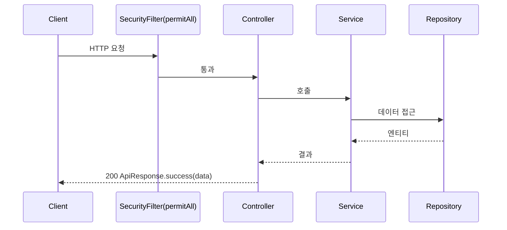
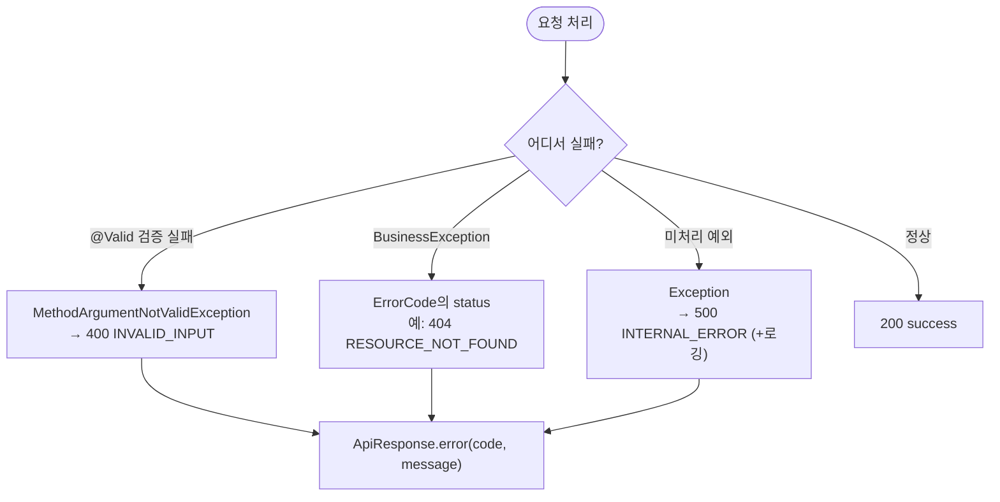

# Phase 1 — 공통 기반 (Common Foundation) Design Doc

> Status: Draft
> Created: 2026-05-29

## Context

Phase 0 스캐폴드로 엔티티·스키마·인프라는 갖춰졌지만, 아직 요청을 처리하는 어떤 계층(Repository/Service/Controller)도 없고 응답·에러 포맷, API 문서 노출, 보안 필터 같은 공통 토대가 비어 있다. 이후 모든 도메인 단계(상품·재고·인증)는 동일한 응답 봉투와 예외 처리 규약 위에서 구현되어야 일관성이 유지되므로, 도메인 로직을 짜기 **전에** 이 토대를 먼저 세운다. 또한 개발 공백기 이후 직접 점진 구현으로 감각을 회복하는 단계이므로, 첫 단계는 난도가 낮고 범위가 명확한 "공통 기반"으로 잡아 Spring 기본 구조(Bean 등록, `@RestControllerAdvice`, `SecurityFilterChain`, springdoc)를 다시 손에 익히는 목적도 겸한다. 현재 Spring Security 스타터가 클래스패스에 있어 모든 엔드포인트가 401이라, Swagger조차 열리지 않는 상태를 임시 `SecurityConfig`로 해소한다.

## Goals & Non-Goals

### Goals
- 4개 도메인 Repository(`JpaRepository`) 등록.
- 일관된 응답 봉투 `ApiResponse<T>` 도입.
- 전역 예외 처리(`GlobalExceptionHandler` + `ErrorCode` + `BusinessException`) — 검증 실패/비즈니스 예외/미처리 예외를 표준 에러 응답으로 변환.
- Swagger(OpenAPI) 메타데이터 설정 및 공개 노출.
- **임시** `SecurityConfig`(전체 permitAll)로 개발 중 엔드포인트·Swagger 접근 가능화.

### Non-Goals
- 도메인 비즈니스 로직(상품 CRUD, 재고 입출고) — Phase 2·5.
- 실제 인증/인가, JWT, 로그인 — Phase 4 (이때 임시 SecurityConfig를 정식 교체).
- Redis 캐싱/락 — Phase 3·6.
- Repository 커스텀 쿼리 메서드 — 필요한 시점(각 도메인 단계)에 추가.

## Architecture



Phase 1에서 실제로 생성하는 산출물은 **Repository 4개, `ApiResponse`, 예외 처리 3종, `OpenApiConfig`, 임시 `SecurityConfig`** 이다. Controller/Service는 다이어그램상 위치만 표시하며 도메인 단계에서 채워진다. 모든 응답은 정상이면 `ApiResponse.success`, 예외면 `GlobalExceptionHandler`를 거쳐 `ApiResponse.error`로 통일된다.

## Sequence / Flow

### Happy Path



1. 요청이 임시 SecurityFilter를 그대로 통과한다.
2. Controller → Service → Repository로 처리된다.
3. 정상 결과는 `ApiResponse.success(data)`로 감싸 200 응답.

### Error Paths



- **검증 실패**(`@Valid` 바인딩 오류) → `400`, 코드 `INVALID_INPUT`, 메시지에 필드 오류 요약.
- **비즈니스 예외**(`BusinessException`) → `ErrorCode`에 매핑된 status/코드(예: 미존재 리소스 `404`).
- **미처리 예외** → `500`, 코드 `INTERNAL_ERROR`, 상세는 로깅하고 응답엔 일반 메시지(내부 정보 비노출).

## Decisions & Rationale

### Decision 1: 일관된 `ApiResponse<T>` 응답 봉투 채택
- **Decision**: 성공·실패 모두 `{ success, data, error }` 형태의 `ApiResponse<T>`로 감싼다.
- **Alternatives**: ① 성공은 raw DTO 반환, 실패만 Spring 6의 `ProblemDetail`(RFC 7807). ② 봉투 없이 상태코드만.
- **Rationale**: 프런트/문서에서 분기 처리가 단순하고, 포트폴리오에서 "일관된 API 규약"을 보여주기 좋다. ProblemDetail은 표준이지만 성공/실패 응답 형태가 갈려 학습·설명 비용이 늘어난다.
- **Impact**: 모든 Controller가 `ApiResponse`를 반환. 추후 ProblemDetail로 전환하려면 핸들러만 교체하면 됨(영향 국소화).

### Decision 2: `ErrorCode` enum + `BusinessException` 단일 예외
- **Decision**: HTTP status·코드·기본 메시지를 담은 `ErrorCode` enum과, 그것을 들고 다니는 `BusinessException` 하나로 비즈니스 오류를 표현한다.
- **Alternatives**: 예외 클래스를 종류별로(NotFoundException, DuplicateException…) 다수 정의하고 각각 핸들러 작성.
- **Rationale**: 오류 카탈로그가 enum 한 곳에 모여 일관·검색이 쉽고 핸들러가 단순해진다. 단계가 진행되며 코드만 추가하면 된다.
- **Impact**: 새 오류는 `ErrorCode`에 상수 추가로 확장. 예외 계층이 얕아 디버깅 시 스택만으로는 구분이 약한 단점은 코드 문자열로 보완.

### Decision 3: 임시 `SecurityConfig`(permitAll) 도입
- **Decision**: Phase 1~3 동안 전체 허용하는 `SecurityConfig` Bean을 두고, "임시"임을 주석·문서에 명시한다.
- **Alternatives**: ① `spring-boot-starter-security` 의존성을 임시 제거(exclude). ② `@SpringBootApplication(exclude = SecurityAutoConfiguration.class)`.
- **Rationale**: 의존성을 뺐다 넣으면 Phase 4에서 빌드/설정이 출렁인다. 설정 Bean 한 개만 두면 Phase 4에서 그 파일만 정식 규칙으로 교체하면 되어 변경이 국소적이다.
- **Impact**: 개발 중 모든 엔드포인트·Swagger 접근 가능(보안 없음). 운영 배포(Phase 7) 전에 반드시 Phase 4 완료 필요 — ROADMAP 의존성에 명시.

## Edge Cases & Error Handling

- **`@Valid` 검증 실패** → `400 INVALID_INPUT`. 첫 번째(또는 요약) 필드 오류 메시지를 `error.message`에 포함.
- **존재하지 않는 리소스 조회**(도메인 단계에서 `throw new BusinessException(RESOURCE_NOT_FOUND)`) → `404`. (Phase 1엔 호출 Controller가 없으므로 핸들러 동작은 슬라이스 테스트로 검증.)
- **중복 리소스**(예: 동일 SKU/이메일) → `409 DUPLICATE_RESOURCE` (도메인 단계에서 사용).
- **미처리 예외**(NPE 등) → `500 INTERNAL_ERROR`. 스택트레이스는 서버 로그로만, 응답엔 일반 메시지(민감정보 비노출).
- **임시 보안**: permitAll이라 인증 관련 엣지케이스 없음 — Phase 4 design doc에서 다룸.

## (Optional) Data Model
_N/A_ — 스키마 변경 없음 (Phase 0의 테이블 그대로 사용).

## (Optional) API / Interface
_N/A_ — 새 엔드포인트 없음. Swagger UI(`/swagger-ui.html`)는 메타데이터만 노출(엔드포인트는 Phase 2부터 등록).

## (Optional) Security
임시 permitAll. 정식 인증/인가는 Phase 4. 상세는 Decision 3 참조.

## (Optional) Open Questions
_N/A_

## (Optional) Out of Scope
- 도메인 Controller/Service, 커스텀 쿼리, 캐싱/락, 정식 보안 — 후속 Phase.

---

# Implementation Plan

> 본 문서 승인 후 구현 시작. 사용자가 직접 점진 구현하며, 각 Step은 단독 검증 가능.

## Target Files

| File | Action | Purpose |
|---|---|---|
| `repository/ProductRepository.java` | Create | 상품 JPA Repository |
| `repository/InventoryRepository.java` | Create | 재고 JPA Repository |
| `repository/StockLogRepository.java` | Create | 입출고 이력 JPA Repository |
| `repository/MemberRepository.java` | Create | 회원 JPA Repository |
| `dto/response/ApiResponse.java` | Create | 공통 응답 봉투 |
| `exception/ErrorCode.java` | Create | 오류 카탈로그(enum) |
| `exception/BusinessException.java` | Create | 비즈니스 예외 |
| `exception/GlobalExceptionHandler.java` | Create | 전역 예외 → 표준 응답 |
| `config/OpenApiConfig.java` | Create | Swagger/OpenAPI 메타데이터 |
| `security/SecurityConfig.java` | Create | 임시 permitAll 보안 설정 |
| `src/test/.../exception/GlobalExceptionHandlerTest.java` | Create | 핸들러+봉투 슬라이스 테스트 |

## Implementation Steps

### Step 1: Repository 4개
- **File**: `repository/*Repository.java`
- **Action**: Create
- **Key snippet**:
  ```java
  public interface ProductRepository extends JpaRepository<Product, Long> { }
  // Inventory/StockLog/Member도 동일 패턴. 커스텀 쿼리는 도메인 단계에서 추가.
  ```
- **Verify**: `./gradlew build` 통과 + 앱 기동 시 Repository Bean 등록 오류 없음.

### Step 2: ApiResponse 응답 봉투
- **File**: `dto/response/ApiResponse.java`
- **Action**: Create
- **Key snippet**:
  ```java
  public record ApiResponse<T>(boolean success, T data, ErrorBody error) {
      public static <T> ApiResponse<T> success(T data) { return new ApiResponse<>(true, data, null); }
      public static ApiResponse<Void> error(String code, String message) {
          return new ApiResponse<>(false, null, new ErrorBody(code, message));
      }
      public record ErrorBody(String code, String message) {}
  }
  ```
- **Verify**: 컴파일 통과. (Step 7 테스트에서 직렬화 형태 `$.success/$.error.code` 확인.)

### Step 3: ErrorCode + BusinessException
- **File**: `exception/ErrorCode.java`, `exception/BusinessException.java`
- **Action**: Create
- **Key snippet**:
  ```java
  @Getter @RequiredArgsConstructor
  public enum ErrorCode {
      INVALID_INPUT(HttpStatus.BAD_REQUEST, "C001", "입력값이 올바르지 않습니다."),
      RESOURCE_NOT_FOUND(HttpStatus.NOT_FOUND, "C002", "요청한 리소스를 찾을 수 없습니다."),
      DUPLICATE_RESOURCE(HttpStatus.CONFLICT, "C003", "이미 존재하는 리소스입니다."),
      INTERNAL_ERROR(HttpStatus.INTERNAL_SERVER_ERROR, "C999", "서버 내부 오류가 발생했습니다.");
      private final HttpStatus status; private final String code; private final String message;
  }

  @Getter
  public class BusinessException extends RuntimeException {
      private final ErrorCode errorCode;
      public BusinessException(ErrorCode ec) { super(ec.getMessage()); this.errorCode = ec; }
      public BusinessException(ErrorCode ec, String message) { super(message); this.errorCode = ec; }
  }
  ```
- **Verify**: 컴파일 통과.

### Step 4: GlobalExceptionHandler
- **File**: `exception/GlobalExceptionHandler.java`
- **Action**: Create
- **Key snippet**:
  ```java
  @RestControllerAdvice
  public class GlobalExceptionHandler {
      @ExceptionHandler(BusinessException.class)
      public ResponseEntity<ApiResponse<Void>> handle(BusinessException e) {
          ErrorCode ec = e.getErrorCode();
          return ResponseEntity.status(ec.getStatus())
                  .body(ApiResponse.error(ec.getCode(), e.getMessage()));
      }
      @ExceptionHandler(MethodArgumentNotValidException.class)
      public ResponseEntity<ApiResponse<Void>> handleValidation(MethodArgumentNotValidException e) {
          String msg = e.getBindingResult().getFieldErrors().stream()
                  .findFirst().map(f -> f.getField() + ": " + f.getDefaultMessage())
                  .orElse(ErrorCode.INVALID_INPUT.getMessage());
          return ResponseEntity.badRequest()
                  .body(ApiResponse.error(ErrorCode.INVALID_INPUT.getCode(), msg));
      }
      @ExceptionHandler(Exception.class)
      public ResponseEntity<ApiResponse<Void>> handle(Exception e) {
          log.error("Unhandled exception", e); // 상세는 로그만
          ErrorCode ec = ErrorCode.INTERNAL_ERROR;
          return ResponseEntity.status(ec.getStatus()).body(ApiResponse.error(ec.getCode(), ec.getMessage()));
      }
  }
  ```
- **Verify**: Step 7 테스트 그린.

### Step 5: OpenApiConfig
- **File**: `config/OpenApiConfig.java`
- **Action**: Create
- **Key snippet**:
  ```java
  @Configuration
  public class OpenApiConfig {
      @Bean
      public OpenAPI inventoryOpenAPI() {
          return new OpenAPI().info(new Info()
              .title("재고관리 API").version("v0.1")
              .description("상품·재고·입출고 관리 REST API"));
      }
  }
  ```
- **Verify**: 앱 기동 후 `/v3/api-docs`에 title/version 반영(단, Step 6 이후 200 접근 가능).

### Step 6: 임시 SecurityConfig (permitAll)
- **File**: `security/SecurityConfig.java`
- **Action**: Create
- **Key snippet**:
  ```java
  @Configuration
  @EnableWebSecurity
  public class SecurityConfig {
      // ⚠️ 임시: Phase 4에서 JWT 인증/인가로 교체. 현재는 개발 편의상 전체 허용.
      @Bean
      public SecurityFilterChain filterChain(HttpSecurity http) throws Exception {
          http.csrf(csrf -> csrf.disable())
              .authorizeHttpRequests(auth -> auth.anyRequest().permitAll());
          return http.build();
      }
  }
  ```
- **Verify**: `docker compose up` 후 앱 기동 → `curl -o /dev/null -w '%{http_code}' http://localhost:8080/swagger-ui/index.html` 가 **200**.

### Step 7: 예외 핸들러 슬라이스 테스트
- **File**: `src/test/java/com/inventory/exception/GlobalExceptionHandlerTest.java`
- **Action**: Create
- **Key snippet**:
  ```java
  @WebMvcTest(GlobalExceptionHandlerTest.StubController.class)
  @Import({GlobalExceptionHandler.class, SecurityConfig.class})
  class GlobalExceptionHandlerTest {
      @RestController static class StubController {
          @GetMapping("/_test/notfound") void notfound() { throw new BusinessException(ErrorCode.RESOURCE_NOT_FOUND); }
      }
      @Autowired MockMvc mvc;
      @Test void businessException_maps_status_and_envelope() throws Exception {
          mvc.perform(get("/_test/notfound"))
             .andExpect(status().isNotFound())
             .andExpect(jsonPath("$.success").value(false))
             .andExpect(jsonPath("$.error.code").value("C002"));
      }
  }
  ```
- **Verify**: `./gradlew test` 그린 (도메인 Controller 없이도 핸들러+봉투 동작 확인).

## Order Constraints

- Step 2(ApiResponse) → Step 3(ErrorCode/BusinessException) → Step 4(GlobalExceptionHandler) 순서 필요(핸들러가 둘에 의존).
- Step 1·5·6은 상호 독립(병렬 가능).
- Step 7은 Step 2~6 이후.
