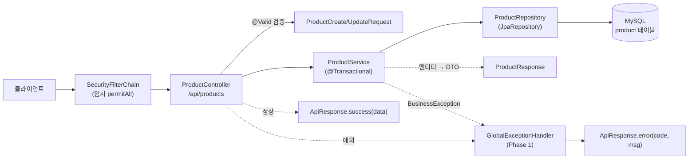
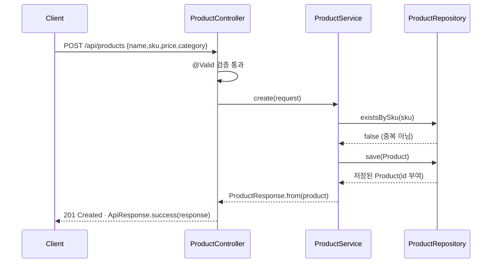
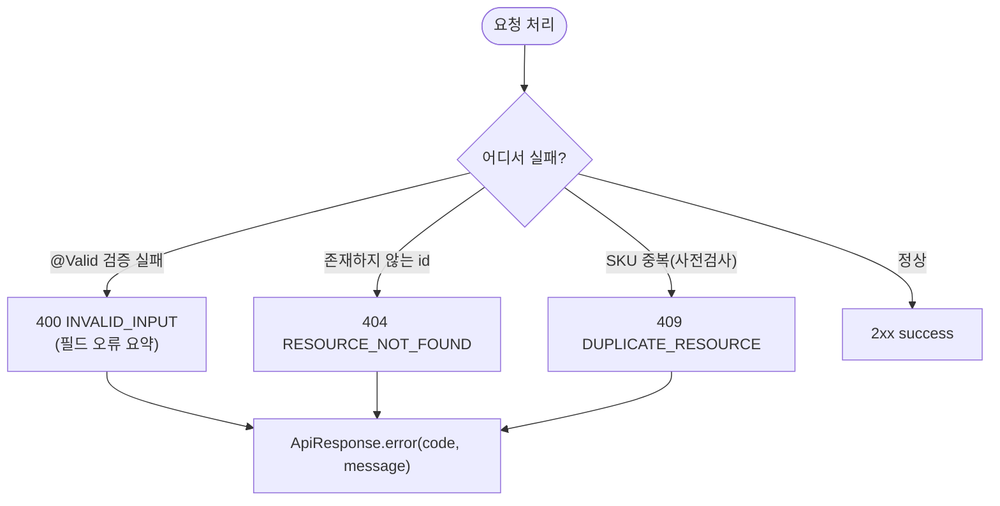

# Phase 2 — 상품 CRUD (Product CRUD) Design Doc

> Status: Draft
> Created: 2026-06-02

## 2026-06-09 보완 결정: 페이지 목록 캐시 DTO

- 상품 목록은 `Pageable` 기반으로 조회하며 외부 응답은 `PageResponse<ProductResponse>`를 사용한다.
- Redis에는 Jackson 역직렬화가 어려운 Spring Data의 `PageImpl`을 직접 저장하지 않는다.
- `ProductService.findAll(Pageable)`이 Repository의 `Page<Product>`를 `PageResponse<ProductResponse>`로 변환해 반환하며, 이 DTO를 목록 캐시에 저장한다.
- Controller는 서비스가 반환한 `PageResponse`를 추가 변환 없이 `ApiResponse`로 감싼다.
- 외부 JSON 응답 구조는 기존 `content`, `page`, `size`, `totalElements`, `totalPages`, `first`, `last` 형식을 유지한다.

## Context

Phase 1로 공통 토대(Repository 4개·`ApiResponse` 봉투·`GlobalExceptionHandler`+`ErrorCode`·임시 `SecurityConfig`·Swagger)는 갖춰졌지만, 아직 요청을 처리하는 **도메인 기능이 하나도 없다**. 엔드포인트가 비어 있어 토대가 실제로 잘 맞물리는지(봉투·예외 변환·Repository) 검증되지 않은 상태다. Phase 2는 그 토대 위에서 상품 5개 API(목록/상세/등록/수정/삭제)를 Spring MVC + JPA 풀스택으로 1회전하며, Phase 1 산출물이 처음으로 "함께" 도는 것을 확인한다. 동시에 이후 모든 도메인 단계가 의존할 **Testcontainers(MySQL) 통합테스트 환경**을 최초 도입한다 — 실제 MySQL 위에서 Flyway 마이그레이션 + Hibernate `validate`가 통과하는지까지 자동 검증하기 위함이다. 상품은 재고(Phase 5)·입출고가 참조하는 가장 기본 엔티티이므로 도메인 중 가장 먼저 구현한다.

## Goals & Non-Goals

### Goals
- 상품 5개 REST API 완성: 목록(전체)/상세/등록/수정/삭제.
- request/response DTO 분리 + Bean Validation으로 입력 검증.
- 모든 응답을 Phase 1 `ApiResponse` 봉투로 통일, 오류는 기존 `GlobalExceptionHandler`로 변환.
- SKU 중복 등록 차단(409), 미존재 리소스 접근 차단(404).
- 단위 테스트(Service) + Testcontainers MySQL 통합 테스트(API 라운드트립) 도입.

### Non-Goals
- 재고 수량·입출고 — Phase 5 (`ProductResponse`에 재고 미포함).
- Redis 캐싱(`@Cacheable`/`@CacheEvict`) — Phase 3.
- 인증/인가(누가 상품을 등록할 수 있는가) — Phase 4 (현재 임시 permitAll).
- 페이지네이션·검색·정렬 — 전체 리스트 반환으로 시작(필요 시 follow-up).
- SKU 변경 기능 — SKU는 불변(생성 시 고정).
- 동시 등록 경합의 애플리케이션 레벨 처리 — DB 유니크 제약이 안전망, 정식 동시성은 Phase 6.

## Architecture



Phase 2가 새로 만드는 것은 **Controller / Service / DTO 3종**이며, `ProductRepository`(메서드 1개 추가)·`Product`(update 메서드 추가)는 소폭 확장한다. `ApiResponse`·`GlobalExceptionHandler`·`ErrorCode`·`SecurityConfig`는 Phase 1 산출물을 **그대로 재사용**한다. 계층 책임은: Controller(HTTP 변환·검증 트리거·봉투 래핑) → Service(트랜잭션·비즈니스 규칙·DTO 매핑) → Repository(영속성). 엔티티는 Controller로 새어 나가지 않고 항상 `ProductResponse`로 변환되어 나간다.

## Sequence / Flow

### Happy Path — 상품 등록(POST)



1. 요청이 임시 SecurityFilter를 통과한다.
2. `@Valid`가 `ProductCreateRequest`를 검증(실패 시 아래 Error Paths).
3. Service가 `existsBySku`로 중복을 확인하고, 없으면 저장한다.
4. 저장된 엔티티를 `ProductResponse`로 변환해 201 + 봉투로 응답한다.

조회/수정/삭제도 같은 골격(Controller→Service→Repository→DTO 변환→봉투)을 따른다. 수정(PUT)은 `findById`로 조회 후 엔티티의 `update(...)`를 호출하고 **JPA 변경감지**로 트랜잭션 커밋 시 자동 반영한다(별도 save 불필요).

### Error Paths



- **검증 실패**(`@Valid`: 빈 name, 음수 price 등) → `400 INVALID_INPUT`. Phase 1 핸들러가 첫 필드 오류를 요약.
- **미존재 리소스**(없는 id로 상세/수정/삭제) → Service가 `throw new BusinessException(RESOURCE_NOT_FOUND)` → `404`.
- **SKU 중복 등록** → Service의 `existsBySku` 사전검사로 `throw new BusinessException(DUPLICATE_RESOURCE)` → `409`.

## Decisions & Rationale

### Decision 1: request/response DTO를 record로 분리하고 수동 매핑
- **Decision**: 입력 `ProductCreateRequest`/`ProductUpdateRequest`, 출력 `ProductResponse`를 별도 record로 두고, 엔티티↔DTO 변환은 `ProductResponse.from(Product)` 정적 팩토리 + Service 내 수동 매핑으로 처리한다.
- **Alternatives**: ① 엔티티(`Product`)를 컨트롤러에서 직접 노출. ② MapStruct 등 매핑 라이브러리 도입.
- **Rationale**: 엔티티 직접 노출은 영속성 모델과 API 계약을 결합시켜(LAZY 직렬화 사고, 의도치 않은 필드 노출) 위험하다. MapStruct는 필드가 적은 단일 엔티티엔 과하다(애너테이션 프로세서·학습비용). record + 정적 팩토리는 의존성 0, 변환 지점이 명시적이다.
- **Impact**: 엔티티 필드가 바뀌어도 API 계약은 DTO에서 독립적으로 관리. 도메인이 늘면 매핑 보일러플레이트가 증가하나, 그 시점에 MapStruct 재검토 가능(국소적 교체).

### Decision 2: 목록 조회는 전체 리스트 반환(페이지네이션 미도입)
- **Decision**: `GET /api/products`는 `findAll()` 결과 전체를 `List<ProductResponse>`로 반환한다.
- **Alternatives**: `Pageable`(page/size/sort) 기반 `Page<ProductResponse>` 반환.
- **Rationale**: 포트폴리오 데이터 규모가 작고, 다음 단계(Phase 3) 캐싱을 단순 키(`products::all`)로 도입하기 쉽다. 페이지별 캐시 키 설계는 캐싱 학습의 본질을 흐린다.
- **Impact**: 데이터가 크게 늘면 응답이 비대해질 수 있음 → 페이지네이션은 follow-up으로 분리(추가 시 캐시 키 전략 동반 검토). API 형태가 `List`→`Page`로 바뀌면 클라이언트 계약 변경이 필요하므로 변경 시 버전·공지 고려.

### Decision 3: SKU는 생성 후 불변
- **Decision**: `PUT /api/products/{id}` 수정 대상은 name/price/category만. `ProductUpdateRequest`에 sku 필드를 두지 않는다.
- **Alternatives**: SKU도 수정 허용(변경 시 다른 상품과 중복 재검사).
- **Rationale**: SKU는 상품을 식별하는 비즈니스 키(유니크 제약 `uk_product_sku`)다. 식별 키가 바뀌면 재고·입출고 이력(Phase 5의 외부 참조) 추적이 흔들린다. 불변으로 두면 수정 경로에서 중복 재검사 로직이 사라져 단순해진다.
- **Impact**: SKU 오기입 정정은 "삭제 후 재등록"으로 처리(혹은 follow-up에서 별도 정책). 수정 서비스 로직이 단순(중복 검사 불필요)해진다.

### Decision 4: SKU 중복은 서비스 사전검사 + DB 유니크 제약 안전망
- **Decision**: `create` 시 `existsBySku`로 먼저 검사해 `409 DUPLICATE_RESOURCE`를 명확히 반환하고, DB 유니크 제약(`uk_product_sku`)을 최후의 안전망으로 둔다.
- **Alternatives**: 사전검사 없이 저장 → `DataIntegrityViolationException`을 잡아 409로 변환.
- **Rationale**: 사전검사는 사용자에게 의도가 분명한 에러 코드를 즉시 준다. 예외 캐치 방식은 DB 방언별 예외·메시지 파싱에 의존해 깨지기 쉽다. 단일 스레드·일반 트래픽에서 사전검사로 충분하다.
- **Impact**: 사전검사 통과 후 동시 삽입이 경합하면 DB 유니크 위반이 그대로 올라와 현재 `500`이 된다(드묾). `DataIntegrityViolationException`→`409` 매핑은 **follow-up**으로 미루고, 정식 동시성은 Phase 6에서 다룬다.

### Decision 5: 수정은 JPA 변경감지(dirty checking)로
- **Decision**: 엔티티에 도메인 메서드 `Product.update(name, price, category)`를 추가하고, Service가 트랜잭션 안에서 조회→`update()` 호출만 한다(명시적 save 없음).
- **Alternatives**: setter 노출 후 변경 + `repository.save()` 재호출.
- **Rationale**: setter 전면 개방은 엔티티 불변식을 깨뜨린다. 변경 의도를 담은 도메인 메서드가 의도를 드러내고, 영속 상태 엔티티는 트랜잭션 커밋 시 변경감지로 자동 UPDATE된다(JPA 정석).
- **Impact**: `@Transactional` 경계가 반드시 필요(Service 메서드에 적용). 엔티티가 약간의 도메인 행위를 갖게 되어 빈약한 도메인 모델을 피한다.

### Decision 6: 통합 테스트는 Testcontainers MySQL(`@ServiceConnection`)
- **Decision**: `@SpringBootTest`에 Testcontainers로 실제 MySQL 컨테이너를 띄우고 `@ServiceConnection`으로 데이터소스를 자동 연결한다. 컨테이너 기동은 `AbstractIntegrationTest` 베이스 클래스로 분리해 후속 Phase가 재사용한다.
- **Alternatives**: H2 인메모리 DB로 통합 테스트.
- **Rationale**: 운영이 MySQL이고 스키마는 Flyway 단일 소스다. H2는 방언·타입(`DATETIME(6)`, `DECIMAL`)·Flyway 마이그레이션 호환성이 어긋날 수 있어 "통과했지만 운영에서 실패"를 부른다. 실제 MySQL로 Flyway+`validate`까지 검증해야 의미가 있다.
- **Impact**: 테스트에 Docker 필요(로컬·CI 모두). 첫 컨테이너 기동이 느리나 베이스 클래스로 재사용해 상쇄. `build.gradle`에 Testcontainers 의존성 추가 필요.

## Edge Cases & Error Handling

- **없는 id로 상세/수정/삭제** → `404 RESOURCE_NOT_FOUND`. (조회는 `orElseThrow`, 수정·삭제는 사전 존재 확인.)
- **SKU 중복 등록** → `409 DUPLICATE_RESOURCE` (사전검사). 경합으로 사전검사를 통과한 동시 삽입 → DB 유니크 위반 → 현재 `500`(드묾, Phase 6 범위). `DataIntegrityViolationException`→409 매핑은 follow-up.
- **`@Valid` 검증 실패** — 빈/공백 name·sku, null·0·음수 price, 길이 초과(name>100, sku>50, category>50) → `400 INVALID_INPUT`(Phase 1 핸들러 재사용, 첫 필드 오류 요약).
- **price 정밀도** — 스키마는 `DECIMAL(12,2)`. 소수 3자리 이상 입력은 검증 단계에서 막지 않으면 반올림/절삭 모호 → `@Digits(integer=10, fraction=2)`로 제약(설계상 명시, 구현 시 적용).
- **category 미입력** — nullable이므로 허용(검증 없음).
- **Redis 미기동 영향 없음** — `spring-boot-starter-data-redis`가 클래스패스에 있으나 Lettuce 연결 팩토리는 지연 생성이라, Redis 서버 없이도 `@SpringBootTest` 컨텍스트가 기동된다(Phase 2는 Redis 미사용).

---

## (Optional) Data Model
_N/A_ — 스키마 변경 없음. Phase 0의 `product` 테이블(유니크 `uk_product_sku`)을 그대로 사용한다.

## (Optional) API / Interface

base path `/api/products`, 모든 응답은 `ApiResponse<T>` 봉투.

| Method | Path | Request Body | 성공 | 실패 |
|---|---|---|---|---|
| GET | `/api/products` | — | 200 `ApiResponse<List<ProductResponse>>` | — |
| GET | `/api/products/{id}` | — | 200 `ApiResponse<ProductResponse>` | 404 |
| POST | `/api/products` | `ProductCreateRequest` | 201 `ApiResponse<ProductResponse>` | 400, 409 |
| PUT | `/api/products/{id}` | `ProductUpdateRequest` | 200 `ApiResponse<ProductResponse>` | 400, 404 |
| DELETE | `/api/products/{id}` | — | 200 `ApiResponse<Void>`(data=null) | 404 |

- `ProductCreateRequest` = { name, sku, price, category? }
- `ProductUpdateRequest` = { name, price, category? } (sku 없음)
- `ProductResponse` = { id, name, sku, price, category, createdAt }

## (Optional) Workflow
_N/A_

## (Optional) Performance
_N/A_ — 전체 리스트 반환이 데이터 증가 시 영향 가능(Decision 2). 캐싱은 Phase 3.

## (Optional) Security
임시 permitAll(Phase 1) 유지 — 누구나 상품을 등록/수정/삭제 가능. 정식 인가는 Phase 4. Phase 2 통합 테스트는 인증 없이 호출한다.

## (Optional) Open Questions
_N/A_

## (Optional) Out of Scope
- 페이지네이션·검색·정렬, `DataIntegrityViolationException`→409 매핑, POST `Location` 헤더 → follow-up 후보.
- 재고/입출고 연동, 캐싱, 인증 → Phase 3·4·5.

---

# Implementation Plan

> 본 문서 승인 후 구현 시작. 각 Step은 단독 검증 가능하며, 권장 순서는 의존성 기준이다.

## Target Files

| File | Action | Purpose |
|---|---|---|
| `dto/request/ProductCreateRequest.java` | Create | 등록 요청 + Bean Validation |
| `dto/request/ProductUpdateRequest.java` | Create | 수정 요청(sku 제외) |
| `dto/response/ProductResponse.java` | Create | 응답 DTO + `from(Product)` |
| `repository/ProductRepository.java` | Modify | `existsBySku` 추가 |
| `entity/Product.java` | Modify | 도메인 `update(...)` 메서드 추가 |
| `service/ProductService.java` | Create | CRUD 비즈니스 로직·트랜잭션·매핑 |
| `controller/ProductController.java` | Create | REST 엔드포인트 5개 |
| `build.gradle` | Modify | Testcontainers 테스트 의존성 추가 |
| `src/test/.../product/ProductServiceTest.java` | Create | 서비스 단위 테스트(Mockito) |
| `src/test/.../support/AbstractIntegrationTest.java` | Create | Testcontainers MySQL 베이스 |
| `src/test/.../product/ProductApiIntegrationTest.java` | Create | API 라운드트립 통합 테스트 |

## Implementation Steps

### Step 1: 요청/응답 DTO 3종
- **File**: `dto/request/ProductCreateRequest.java`, `dto/request/ProductUpdateRequest.java`, `dto/response/ProductResponse.java`
- **Action**: Create
- **Key snippet**:
  ```java
  public record ProductCreateRequest(
      @NotBlank @Size(max = 100) String name,
      @NotBlank @Size(max = 50) String sku,
      @NotNull @Positive @Digits(integer = 10, fraction = 2) BigDecimal price,
      @Size(max = 50) String category) {}

  // ProductUpdateRequest: 동일하되 sku 없음.
  public record ProductResponse(Long id, String name, String sku,
                                BigDecimal price, String category, LocalDateTime createdAt) {
      public static ProductResponse from(Product p) {
          return new ProductResponse(p.getId(), p.getName(), p.getSku(),
                                     p.getPrice(), p.getCategory(), p.getCreatedAt());
      }
  }
  ```
- **Verify**: 컴파일 통과(검증 동작은 Step 7·8에서 확인).

### Step 2: ProductRepository에 existsBySku 추가
- **File**: `repository/ProductRepository.java`
- **Action**: Modify
- **Key snippet**:
  ```java
  public interface ProductRepository extends JpaRepository<Product, Long> {
      boolean existsBySku(String sku); // SKU 중복 사전검사
  }
  ```
- **Verify**: `./gradlew build` 통과(쿼리 파생 메서드 이름 검증).

### Step 3: Product 엔티티에 update 메서드 추가
- **File**: `entity/Product.java`
- **Action**: Modify (기존 필드·빌더 유지, 메서드만 추가)
- **Key snippet**:
  ```java
  // 수정 의도를 담은 도메인 메서드. SKU는 불변이므로 대상에서 제외. (Decision 3·5)
  public void update(String name, BigDecimal price, String category) {
      this.name = name;
      this.price = price;
      this.category = category;
  }
  ```
- **Verify**: 컴파일 통과. 기존 엔티티 테스트/매핑에 영향 없음.

### Step 4: ProductService
- **File**: `service/ProductService.java`
- **Action**: Create
- **Key snippet**:
  ```java
  @Service
  @RequiredArgsConstructor
  @Transactional(readOnly = true)
  public class ProductService {
      private final ProductRepository repository;

      public List<ProductResponse> getAll() {
          return repository.findAll().stream().map(ProductResponse::from).toList();
      }
      public ProductResponse get(Long id) {
          return repository.findById(id).map(ProductResponse::from)
              .orElseThrow(() -> new BusinessException(ErrorCode.RESOURCE_NOT_FOUND));
      }
      @Transactional
      public ProductResponse create(ProductCreateRequest req) {
          if (repository.existsBySku(req.sku()))
              throw new BusinessException(ErrorCode.DUPLICATE_RESOURCE);
          Product saved = repository.save(Product.builder()
              .name(req.name()).sku(req.sku()).price(req.price()).category(req.category()).build());
          return ProductResponse.from(saved);
      }
      @Transactional
      public ProductResponse update(Long id, ProductUpdateRequest req) {
          Product p = repository.findById(id)
              .orElseThrow(() -> new BusinessException(ErrorCode.RESOURCE_NOT_FOUND));
          p.update(req.name(), req.price(), req.category()); // 변경감지
          return ProductResponse.from(p);
      }
      @Transactional
      public void delete(Long id) {
          if (!repository.existsById(id))
              throw new BusinessException(ErrorCode.RESOURCE_NOT_FOUND);
          repository.deleteById(id);
      }
  }
  ```
- **Verify**: Step 7 단위 테스트 그린.

### Step 5: ProductController
- **File**: `controller/ProductController.java`
- **Action**: Create
- **Key snippet**:
  ```java
  @RestController
  @RequestMapping("/api/products")
  @RequiredArgsConstructor
  public class ProductController {
      private final ProductService service;

      @GetMapping
      public ApiResponse<List<ProductResponse>> list() { return ApiResponse.success(service.getAll()); }

      @GetMapping("/{id}")
      public ApiResponse<ProductResponse> get(@PathVariable Long id) { return ApiResponse.success(service.get(id)); }

      @PostMapping
      public ResponseEntity<ApiResponse<ProductResponse>> create(@Valid @RequestBody ProductCreateRequest req) {
          return ResponseEntity.status(HttpStatus.CREATED).body(ApiResponse.success(service.create(req)));
      }
      @PutMapping("/{id}")
      public ApiResponse<ProductResponse> update(@PathVariable Long id, @Valid @RequestBody ProductUpdateRequest req) {
          return ApiResponse.success(service.update(id, req));
      }
      @DeleteMapping("/{id}")
      public ApiResponse<Void> delete(@PathVariable Long id) { service.delete(id); return ApiResponse.success(null); }
  }
  ```
- **Verify**: 앱 기동 후 Swagger에 5개 엔드포인트 노출.

### Step 6: build.gradle에 Testcontainers 의존성
- **File**: `build.gradle`
- **Action**: Modify (testImplementation 블록에 추가)
- **Key snippet**:
  ```groovy
  // 버전은 Spring Boot BOM이 관리
  testImplementation 'org.springframework.boot:spring-boot-testcontainers'
  testImplementation 'org.testcontainers:junit-jupiter'
  testImplementation 'org.testcontainers:mysql'
  ```
- **Verify**: `./gradlew dependencies` 또는 빌드에서 의존성 해소.

### Step 7: ProductService 단위 테스트(Mockito)
- **File**: `src/test/java/com/inventory/product/ProductServiceTest.java`
- **Action**: Create
- **Key snippet**:
  ```java
  @ExtendWith(MockitoExtension.class)
  class ProductServiceTest {
      @Mock ProductRepository repository;
      @InjectMocks ProductService service;

      @Test void create_duplicateSku_throws409() {
          given(repository.existsBySku("A")).willReturn(true);
          assertThatThrownBy(() -> service.create(new ProductCreateRequest("n","A",TEN,null)))
              .isInstanceOf(BusinessException.class)
              .extracting("errorCode").isEqualTo(ErrorCode.DUPLICATE_RESOURCE);
      }
      @Test void get_missing_throws404() {
          given(repository.findById(1L)).willReturn(Optional.empty());
          assertThatThrownBy(() -> service.get(1L))
              .extracting("errorCode").isEqualTo(ErrorCode.RESOURCE_NOT_FOUND);
      }
      // update_missing_404, update_success_mutatesFields, delete_missing_404 ...
  }
  ```
- **Verify**: `./gradlew test --tests "*ProductServiceTest"` 그린.

### Step 8: Testcontainers 베이스 + API 통합 테스트
- **File**: `src/test/java/com/inventory/support/AbstractIntegrationTest.java`, `src/test/java/com/inventory/product/ProductApiIntegrationTest.java`
- **Action**: Create
- **Key snippet**:
  ```java
  @SpringBootTest
  @AutoConfigureMockMvc
  @Testcontainers
  public abstract class AbstractIntegrationTest {
      @Container @ServiceConnection
      static final MySQLContainer<?> MYSQL = new MySQLContainer<>("mysql:8.0");
  }

  class ProductApiIntegrationTest extends AbstractIntegrationTest {
      @Autowired MockMvc mvc;
      // POST 201 → GET 목록/상세 → PUT 반영 → DELETE → GET 상세 404
      // 중복 SKU 409, 빈 name 400
  }
  ```
- **Verify**: Docker 기동 상태에서 `./gradlew test` 그린(Flyway 마이그레이션 + Hibernate validate 통과 + CRUD 라운드트립).

## Order Constraints

- Step 1(DTO) → Step 4(Service) → Step 5(Controller) 순서 필요(상위가 하위에 의존).
- Step 2(Repository)·Step 3(Entity)는 Step 4 이전에 있어야 함(Service가 둘을 사용).
- Step 6(build.gradle)은 Step 8(통합 테스트) 이전.
- Step 7(단위)·Step 8(통합)은 구현(1~6) 이후. Step 7과 8은 상호 독립.
